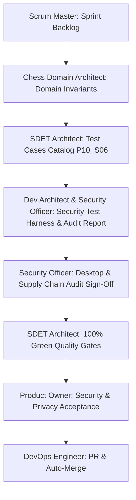

# Pre-Implementation Test Cases Catalog: Phase 10 · Sprint 06

**Sprint:** Phase 10 · Sprint 06: Security and Dependency Audit  
**Target Specification:** [Product Requirements Baseline](file:///c:/Workspace/ChessGame/docs/product-requirements.md), [Testing Strategy](file:///c:/Workspace/ChessGame/docs/testing-strategy.md), [Phase 10 Quality Engineering Plan](file:///c:/Workspace/ChessGame/planning/phases/10-phase-quality-engineering-release-candidate.md), [Universal Multi-Agent Operating Contract](file:///c:/Workspace/ChessGame/AGENTS.md)  
**Author:** SDET Architect & Security Officer  
**Status:** `Approved & Ready for Execution`

---

## 1. Overview & Objectives

The primary objective of **Phase 10 · Sprint 06** is to establish, execute, and verify the comprehensive security posture, dependency integrity, capability boundaries, and privacy invariants of ChessForge prior to Windows desktop release:

1. **Tauri Capabilities & Principle of Least Privilege:** Scoped permissions restricted strictly to core default desktop window management. No dangerous capabilities (e.g. `fs:*`, `shell:*`, `http:*`, arbitrary process execution) enabled in `src-tauri/capabilities/default.json` or `tauri.conf.json`.
2. **Strict Content Security Policy (CSP):** Restrict script, styling, image, and network connect sources (`connect-src 'self' ipc: http://ipc.localhost;`) ensuring zero external network egress or third-party script execution.
3. **Untrusted Input Sanitization:** Robust validation of user-imported FEN strings and PGN files, preventing script injection (XSS), prototype pollution, unbounded buffer allocations, or crashing on malformed/adversarial inputs.
4. **Stockfish Engine WebWorker Sandboxing:** Untrusted UCI move outputs sanitized via the chess domain's authoritative legal move generator before modifying game state.
5. **Zero Secret Tolerance:** Comprehensive automated scan across source code, assets, configuration, and documentation ensuring zero hardcoded API keys, private keys, certificates, passwords, or authentication tokens.
6. **Supply Chain & Dependency Audit:** Verification of zero high/critical vulnerabilities across `npm` dependencies (`npm audit`) and minimal Rust crate dependencies.
7. **Offline Privacy & Zero Telemetry Invariant:** Absolute guarantee that no analytics, crash reporters, remote tracking, or external telemetry platforms exist in the application.

---

## 2. Test Cases Specification

### 2.1 Security & Dependency Audit Test Cases (TC-SEC-01 to TC-SEC-07)

| Test ID       | Security Dimension                     | Description & Test Procedure                                                                                                                       | Security Standard & Assertion Contract                                                                                                           | Test Suite Target                |
| :------------ | :------------------------------------- | :------------------------------------------------------------------------------------------------------------------------------------------------- | :----------------------------------------------------------------------------------------------------------------------------------------------- | :------------------------------- |
| **TC-SEC-01** | Tauri Capability & Scoped Permissions  | Inspect `src-tauri/capabilities/default.json` and `src-tauri/tauri.conf.json` for least-privilege permission grants.                               | Permissions restricted to `["core:default"]`; zero `shell:*`, `fs:*`, `http:*`, or wildcard capabilities enabled.                                | `src/test/securityAudit.test.ts` |
| **TC-SEC-02** | Content Security Policy (CSP) Baseline | Verify `app.security.csp` header in Tauri configuration.                                                                                           | `connect-src` restricted to `'self' ipc: http://ipc.localhost;`; `default-src 'self'`; zero unvetted external domains allowed.                   | `src/test/securityAudit.test.ts` |
| **TC-SEC-03** | Untrusted PGN/FEN Input Sanitization   | Inject adversarial PGN payloads (XSS script tags in metadata headers, oversized tags, invalid move sequences) and malformed/truncated FEN strings. | Payloads parsed safely without executing code or throwing unhandled exceptions; invalid positions rejected gracefully with `Result.err` or null. | `src/test/securityAudit.test.ts` |
| **TC-SEC-04** | Engine UCI Output Validation           | Inject illegal UCI moves, malformed bestmove tokens, and adversarial strings into the engine message bridge.                                       | Illegal moves rejected by domain validation; zero corruption of authoritative game state; engine treated as an advisor, not authority.           | `src/test/securityAudit.test.ts` |
| **TC-SEC-05** | Secret Scanning & Key Leakage          | Scan entire workspace for AWS keys, private keys (`BEGIN PRIVATE KEY`), GitHub PAT tokens, JWTs, and database URLs.                                | 0 hardcoded secrets found across all source files, documentation, and configuration.                                                             | `src/test/securityAudit.test.ts` |
| **TC-SEC-06** | Dependency Supply Chain Audit          | Run `npm audit` and verify package manifest for unvetted or vulnerable packages.                                                                   | 0 critical/high/moderate vulnerabilities in production and dev dependencies.                                                                     | `src/test/securityAudit.test.ts` |
| **TC-SEC-07** | Offline Privacy & Telemetry Defense    | Search codebase for remote analytics endpoints (Google Analytics, Mixpanel, Sentry, Telemetry ping, external HTTP fetch).                          | 0 telemetry calls; 100% local-first offline operation verified.                                                                                  | `src/test/securityAudit.test.ts` |

---

## 3. Flake Prevention & Quality Gate Metrics

| Test ID        | Gate / Threshold            | Description                                                                      | Standard                                                                  |
| :------------- | :-------------------------- | :------------------------------------------------------------------------------- | :------------------------------------------------------------------------ |
| **TC-GATE-01** | Zero Flakiness Guarantee    | Security verification suites run deterministically in CI and local environments. | 100% Pass Rate across repeated executions; zero non-deterministic checks. |
| **TC-GATE-02** | Anti-Suppression Invariant  | Zero `test.skip`, `xit`, or `eslint-disable` workarounds in security tests.      | All assertions active and strictly enforced.                              |
| **TC-GATE-03** | Zero Vulnerability Ceiling  | Dependency vulnerability count reported by package managers.                     | 0 vulnerabilities (`npm audit`).                                          |
| **TC-GATE-04** | Execution Time Optimization | Execution duration of the security test harness.                                 | Security test suite completes in $< 5\text{ s}$.                          |

---

## 4. Test Traceability & Sign-Off Matrix

- **Sign-Off:** SDET Architect & Security Officer
- **Pass Criteria:**
  - 100% Green across all Security & Dependency suites.
  - Zero test skips (`test.skip`), zero vulnerabilities, zero hardcoded secrets.
  - Formal Security & Dependency Audit Report published in `docs/security/security_and_dependency_audit_report_P10_S06.md`.
