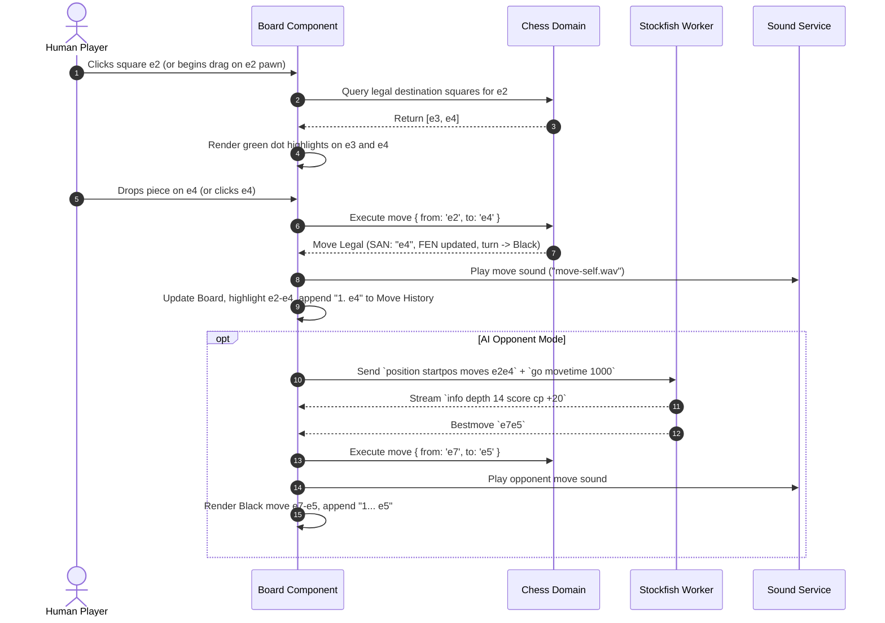
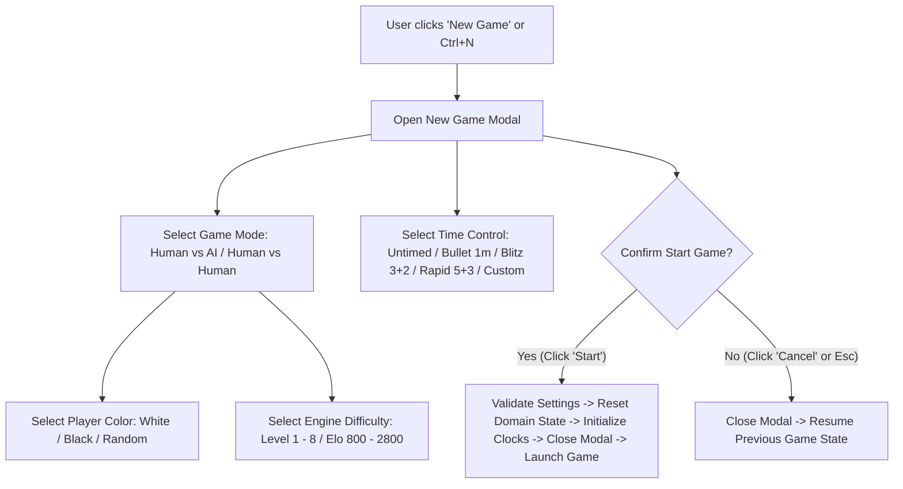
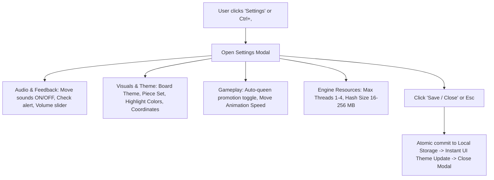
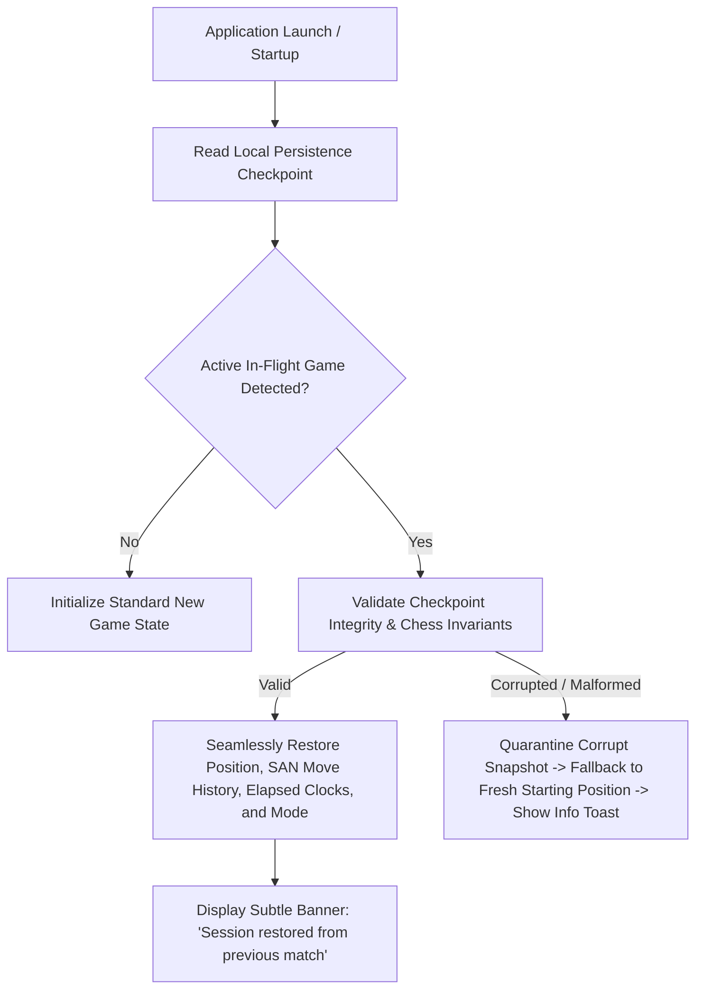

# ChessForge: UX Journeys & Screen Specifications

**Sprint:** `Phase 01 · Sprint 02: UX Journeys and Information Architecture`  
**Author:** Dev Architect & Senior SDE  
**Status:** `Approved Specification Baseline`  
**Target Platform:** Windows 10/11 x64 Desktop (Tauri v2 + React + TypeScript)

---

## 1. Executive Summary & Design Principles

The UX architecture of **ChessForge** is engineered to provide a distraction-free, responsive, and visually refined desktop chess experience. The interface adheres to five core interaction principles:

1. **Board as the Anchor:** The 8x8 chessboard is the primary visual and interactive center. Ancillary panels (move history, clocks, evaluation bar) support rather than overwhelm the board.
2. **Zero Ambient Latency (60 FPS):** All piece dragging, hovering, drop animations, and turn indicators execute smoothly with zero blocking from AI engine computations or background persistence.
3. **Modal & Non-Modal Zoning:** Disruptive actions (New Game, Settings, Import) appear in focused modal dialogs with strict focus trapping, while active game controls (flip, undo, resign, draw offer) remain accessible non-modally.
4. **Resilient Local Persistence:** Game state, clock timestamps, and user preferences are automatically checkpointed; unexpected desktop restarts or window closures allow immediate 1-click recovery.
5. **Keyboard & Screen-Reader First-Class Ergonomics:** Every critical gameplay and navigation action has dedicated keyboard bindings, clear focus rings, and WCAG-compliant high-contrast visibility.

---

## 2. Low-Fidelity Screen Architecture & Layout Zoning

### 2.1 Desktop Window Geometry (1024x768 Minimum, Scalable to 4K)

```text
+--------------------------------------------------------------------------------------------------+
| [Icon] ChessForge  | File  Game  Engine  Settings  Help                      [ _ ] [ [] ] [ X ] |
+--------------------------------------------------------------------------------------------------+
|                                  TOP APPLICATION BAR                                             |
| [New Game] [Flip Board] [Undo] [Resign] [Draw]     Status: White to move     [⚙ Settings] [Export] |
+--------------------------------------------------------------------------------------------------+
|               |                                                   |                              |
|   EVAL BAR    |            LEFT / CENTER: BOARD VIEWPORT          |      RIGHT SIDEBAR PANEL     |
|               |                                                   |                              |
| [ +0.42 ]     |   [Opponent Info: Stockfish Level 4 (1500)]       |  +------------------------+  |
|               |   [Captured by White: ♙ ♙ ♘ (+1)]                 |  | OPPONENT CLOCK: 04:52  |  |
| |===========| |                                                   |  +------------------------+  |
| |           | |     8 [ r ][ n ][ b ][ q ][ k ][ b ][ n ][ r ]    |  | MOVE HISTORY TABLE     |  |
| |           | |     7 [ p ][ p ][ p ][ p ][ . ][ p ][ p ][ p ]    |  | 1. e4       e5         |  |
| |           | |     6 [ . ][ . ][ . ][ . ][ . ][ . ][ . ][ . ]    |  | 2. Nf3      Nc6        |  |
| |           | |     5 [ . ][ . ][ . ][ . ][ p ][ . ][ . ][ . ]    |  | 3. Bb5      a6         |  |
| |           | |     4 [ . ][ . ][ . ][ . ][ P ][ . ][ . ][ . ]    |  | 4. Ba4      Nf6        |  |
| |           | |     3 [ . ][ . ][ . ][ . ][ . ][ N ][ . ][ . ]    |  | 5. O-O      Be7*       |  |
| |===========| |     2 [ P ][ P ][ P ][ P ][ . ][ P ][ P ][ P ]    |  | [|<] [<] [>] [>|]      |  |
|               |     1 [ R ][ N ][ B ][ Q ][ K ][ . ][ . ][ R ]    |  +------------------------+  |
|               |         a   b   c   d   e   f   g   h             |  | PLAYER CLOCK:   04:38  |  |
|               |                                                   |  +------------------------+  |
|               |   [Player Info: Human Player (White)]             |  | ENGINE EVALUATION      |  |
|               |   [Captured by Black: ♟ ♟]                         |  | Depth: 18 | Nodes: 1.2M|  |
|               |                                                   |  | Best: 6. Re1 (Eval: +0.4)|
+---------------+---------------------------------------------------+------------------------------+
| FOOTER: FEN: rnbqkb1r/1pp1bppp/p4n2/3p4/B7/5N2/PPPP1PPP/RNBQ1RK1 b kq - 1 5 | Engine: Stockfish 16 |
+--------------------------------------------------------------------------------------------------+
```

### 2.2 Layout Breakdown & Responsiveness

| Region                        | Component Elements                                                                                                                                | Interaction Rules                                                                                               |
| :---------------------------- | :------------------------------------------------------------------------------------------------------------------------------------------------ | :-------------------------------------------------------------------------------------------------------------- |
| **Top Menu / Header**         | Desktop title bar, Game Controls (`New`, `Flip`, `Undo`, `Resign`, `Offer Draw`), App Status badge, `Settings`, and `Export`.                     | Fixed at top; quick single-click trigger for primary actions and modal openings.                                |
| **Left Eval Gauge**           | Vertical score bar (-10.0 to +10.0 or Mate in N), numerical eval badge.                                                                           | Non-blocking updates from WebWorker engine; smoothly animated bar height; hidden when engine analysis disabled. |
| **Center Board Viewport**     | 8x8 Chessboard, Rank/File coordinate gutters, Last Move highlight (amber/yellow glow), Check warning (red radial pulse), Piece drag ghost.        | Square ratio strictly 1:1; scales dynamically to fill viewport height; drag-and-drop or 2-click move selection. |
| **Opponent / Player Headers** | Avatar/Badge, Player Name / AI Level, captured pieces tray, active material advantage delta (`+1`, `+3`).                                         | Displays active turn glow ring; captured piece trays update dynamically on each capture.                        |
| **Right Sidebar**             | Digital Clocks (active player countdown with millisecond precision under 20s), Scrollable SAN Move Table, Ply Navigation bar, Engine Depth badge. | Fixed width (300-360px); auto-scrolls to active move ply during live play; allows clicking historical plies.    |
| **Bottom Status Footer**      | Current Board FEN string (with 1-click copy icon), Engine Worker status (Ready / Thinking / Offline).                                             | Compact single-line bar at bottom of window.                                                                    |

---

## 3. Granular User Journeys (1 to 10)

---

### Journey 1: Main Game Screen & Active Gameplay Flow



- **Start State:** Application open, board set to initial starting position or loaded game.
- **User Actions:** Click-and-click or drag-and-drop piece movement; hover legal squares; click history ply.
- **UI Reactions:** Real-time square highlight, legal move indicators, last move highlight, dynamic captured piece count update, move notation table auto-scroll.
- **End State:** Turn passed to next player or AI engine with clocks toggled.

---

### Journey 2: New Game Setup Flow



- **Start State:** Active or idle game screen.
- **User Actions:** User triggers `New Game` via header button or `Ctrl+N`.
- **Modal Options:**
  - **Opponent Mode:** `Human vs. Stockfish AI` vs. `Local 2-Player (Pass & Play)`.
  - **Player Color:** `White`, `Black` (board auto-flipped), or `Random` (50/50 roll).
  - **AI Strength:** Slider (Levels 1 to 8 with calibrated Skill Level and UCI Elo presets).
  - **Time Controls:** Radio/Cards: `Untimed`, `1 min (Bullet)`, `3m + 2s (Blitz)`, `5m + 3s (Rapid)`, `10 min (Classical)`, `Custom (Initial mins + Increment secs)`.
- **End State:** Active session initialized with selected parameters; previous game archived to persistence.

---

### Journey 3: Game-Over & Resolution Flow

```mermaid
sequenceDiagram
    autonumber
    actor Player as Player
    participant UI as Desktop UI
    participant Domain as Chess Domain
    participant Clock as Game Clock
    participant Storage as Persistence

    Player->>UI: Plays move delivering Checkmate (e.g. Qh7#)
    UI->>Domain: Validate Move
    Domain-->>UI: Move Legal; GameStatus: CHECKMATE; Winner: White
    UI->>Clock: Stop all clocks immediately
    UI->>UI: Highlight winning move, display king in red checkmate halo
    UI->>Storage: Save final completed game record with result "1-0"
    UI->>UI: Present Game-Over Modal / Non-modal Banner:
    Note over UI: "Checkmate! White is victorious."<br/>Score: 1 - 0 | Moves: 42 | Duration: 08:24
    UI->>Player: Offer Actions: [New Game] [Rematch] [Export PGN] [Review Board]
```

- **Termination Reasons Handled:**
  - **Checkmate:** King in check with zero legal moves. Displays winner name/color.
  - **Stalemate:** Active player has zero legal moves but is not in check. Displays "Draw by Stalemate (½ - ½)".
  - **Insufficient Material:** (e.g., K vs K, K+B vs K, K+N vs K). Displays "Draw by Insufficient Material".
  - **Threefold Repetition:** Exact same position repeated 3 times. Automatic claim or 1-click claim button.
  - **50-Move Rule:** 50 consecutive plies without pawn move or capture. Displays "Draw by 50-Move Rule".
  - **Time Out:** Clock hits 00:00. Displays "Black wins on time" (or Draw if opponent lacks mating material).
  - **Resignation / Draw Agreement:** Explicit player surrender or mutual draw button click.
- **End State:** Board locked against new moves; ply navigation and PGN export fully functional.

---

### Journey 4: Settings Flow



- **Settings Categories:**
  1. **Board & Aesthetics:** Theme selector (Dark Modern, Classic Wood, Slate, Ice Blue), Piece set selection (Neo, Classic, Alpha), Coordinate gutter visibility (Inside board, Outside gutter, Hidden).
  2. **Audio & Animation:** Sound FX volume (0-100%), Move Animation Duration (Instant, Fast 150ms, Smooth 300ms).
  3. **Gameplay Preferences:** Move method (Drag & Drop, Click to Move, Both), Auto-queen promotion (Prompt vs Always Queen), Legal move dots display (On/Off).
  4. **Engine Controls (Safety Guardrails):** Worker concurrency limit (1 to 4 threads, default 2), Transposition Table Hash Size (16 MB to 256 MB, default 64 MB).
- **End State:** Changes applied instantly across React context and saved to local configuration JSON.

---

### Journey 5: PGN / FEN Import & Export Flows

```mermaid
sequenceDiagram
    autonumber
    actor User as User
    participant UI as Import/Export Modal
    participant OS as Native File Dialog (Tauri IPC)
    participant Domain as Chess Domain Codec
    participant Store as Game State

    Note over User,Store: FEN / PGN IMPORT FLOW
    User->>UI: Selects "Import" -> Chooses FEN or PGN
    alt Paste Raw Text
        User->>UI: Pastes FEN/PGN string into input textarea -> Clicks "Load"
    else Select File
        User->>OS: Opens native Windows Open File Dialog (*.pgn, *.fen)
        OS-->>UI: Returns file text content
    end
    UI->>Domain: Parse & Validate String
    alt Valid String
        Domain-->>UI: Parsing Success (Board state + Move tree loaded)
        UI->>Store: Set active game state -> Close Modal -> Refresh Board & History
    else Malformed / Illegal String
        Domain-->>UI: Error: "Illegal FEN: Black king missing"
        UI->>UI: Show inline error badge; retain modal; 0 state corruption
    end

    Note over User,Store: PGN EXPORT FLOW
    User->>UI: Clicks "Export PGN"
    UI->>Domain: Generate standard 7-tag PGN string
    Domain-->>UI: Return formatted PGN
    alt Copy to Clipboard
        UI->>User: Write to clipboard -> Show "PGN Copied to Clipboard!" Toast
    else Save to File
        UI->>OS: Invoke Tauri native Save File Dialog ("game_2026-08-16.pgn")
        OS-->>User: File saved safely on disk
    end
```

- **FEN Import Validation:** Validates piece counts, 1 king per color, active turn, valid castling tokens, and en passant square legality.
- **PGN Codec Specs:** Standard 7-Tag Roster (`[Event]`, `[Site]`, `[Date]`, `[Round]`, `[White]`, `[Black]`, `[Result]`) + Standard Algebraic Notation (SAN).
- **End State:** Game position or full move history loaded seamlessly into domain.

---

### Journey 6: Crash & Session Recovery Flow



- **Persistence Trigger:** Auto-saved atomically to local JSON after every completed half-move (ply).
- **Saved Attributes:** FEN position, full SAN move history array, active game mode, player colors, engine difficulty, clock remaining seconds for White and Black, and timestamp.
- **End State:** User experiences zero progress loss across accidental app exit or system reboot.

---

### Journey 7: Error & Empty States

| Screen / Component          | State                            | UI Representation                                                                                        | Recovery Action                                                                       |
| :-------------------------- | :------------------------------- | :------------------------------------------------------------------------------------------------------- | :------------------------------------------------------------------------------------ |
| **Move History Table**      | Empty (Move 0)                   | Displays subtle centered text: _"No moves played yet. White to move."_ with dim initial rank indicator.  | Disappears automatically upon first legal move execution.                             |
| **Engine Status Indicator** | Stockfish Worker Offline / Crash | Gray status badge with exclamation: _"AI Engine Offline"_. Non-blocking warning toast.                   | User can continue Human vs Human match; button provided to _"Restart Engine Worker"_. |
| **FEN Import Dialog**       | Malformed FEN String             | Red border around input field with specific syntax error: _"Error at rank 4: unexpected character 'x'"_. | Retains pasted text; allows editing; "Load" button disabled until valid.              |
| **PGN Import Dialog**       | Ambiguous or Illegal Move        | Red banner: _"PGN Parse Error at Move 14. Nf3: Illegal move in current position."_                       | Option to load game up to last valid ply or cancel import.                            |
| **File Export Dialog**      | OS Permission Denied / Disk Full | Desktop warning toast: _"Unable to save file to selected location. Check file permissions."_             | Re-opens file dialog for alternative folder selection.                                |

---

### Journey 8: Keyboard Interaction Expectations

| Key Binding         | Scope             | Functionality                                                 | Ergonomic Rationale                                 |
| :------------------ | :---------------- | :------------------------------------------------------------ | :-------------------------------------------------- |
| `Ctrl+N`            | Global            | Opens **New Game Modal**                                      | Standard desktop shortcut for fresh session.        |
| `Ctrl+Z` / `u`      | Global Gameplay   | Requests **Move Undo** (takes back player move & AI response) | Instant mistake correction during casual play.      |
| `Ctrl+F` / `f`      | Global Gameplay   | **Flips Board Orientation** (180° perspective toggle)         | Fast perspective switch for 2-player local matches. |
| `Space` / `Enter`   | Board Focus       | Selects hovered piece / confirms drop to targeted square      | Full keyboard accessibility without mouse.          |
| `Left Arrow` / `[`  | Gameplay / Review | Steps backward 1 ply in move history                          | Effortless game replay.                             |
| `Right Arrow` / `]` | Gameplay / Review | Steps forward 1 ply in move history                           | Effortless game replay.                             |
| `Home`              | History Review    | Jumps to starting position (Ply 0)                            | Instant start jump.                                 |
| `End`               | History Review    | Jumps to live current board position                          | Instant return to active match.                     |
| `Ctrl+,`            | Global            | Opens **Settings Modal**                                      | Standard desktop settings shortcut.                 |
| `Ctrl+E`            | Global            | Opens **Export Dialog**                                       | Quick PGN/FEN export.                               |
| `Escape`            | Modals / Overlays | Dismisses active modal dialog or deselects piece              | Standard dismissal behavior.                        |
| `Tab` / `Shift+Tab` | Modals            | Cycles keyboard focus forward / backward                      | Standard accessibility focus loop.                  |

---

### Journey 9: Major UI States & Transitions

- The UI operates under a deterministic state machine with seven primary operational states:
  1. `BOOT_INIT`: Reading local configuration and persistence snapshots.
  2. `GAME_ACTIVE`: Normal turn-based gameplay (clocks ticking, pieces draggable).
  3. `GAME_AI_THINKING`: Human played move; Stockfish WASM worker computing bestmove; human drag-and-drop temporarily disabled.
  4. `GAME_REVIEW`: Historical ply selected; board shows past position; clocks paused; live return banner active.
  5. `GAME_ENDED`: Checkmate, draw, or resignation reached; board interactive dragging frozen; resolution banner displayed.
  6. `MODAL_OPEN`: (New Game / Settings / Import / Export); background darkened; focus trapped.
  7. `PROMOTION_PENDING`: Pawn moved to 8th rank; modal pawn promotion picker (Queen, Rook, Bishop, Knight) awaiting user selection before committing move to domain.

---

### Journey 10: Screen Descriptions & Responsive Modal Specifications

#### Pawn Promotion Picker (Overlay Modal)

- Appears immediately above the promotion square upon pawn arrival at rank 8.
- Displays 4 vertical/horizontal piece icons: `Queen (♛)`, `Knight (♞)`, `Rook (♜)`, `Bishop (♝)`.
- Clicking or pressing keys `Q`, `N`, `R`, `B` commits the selected promotion piece to the domain.
- Clicking outside or pressing `Escape` cancels the pawn move and returns the pawn to the source square.

#### Game-Over Resolution Card

- Appears smoothly with a backdrop blur over the center board (or docked non-modally in the sidebar).
- Visual Badge: Crown icon for victory, Handshake icon for draw, Skull/Flag icon for defeat/resignation.
- Text Header: _"White Wins by Checkmate"_, _"Game Drawn by Stalemate"_, _"Black Wins on Time"_.
- Action Buttons: `[ New Game ]`, `[ Rematch ]`, `[ Export PGN ]`, `[ Close & Review Board ]`.
