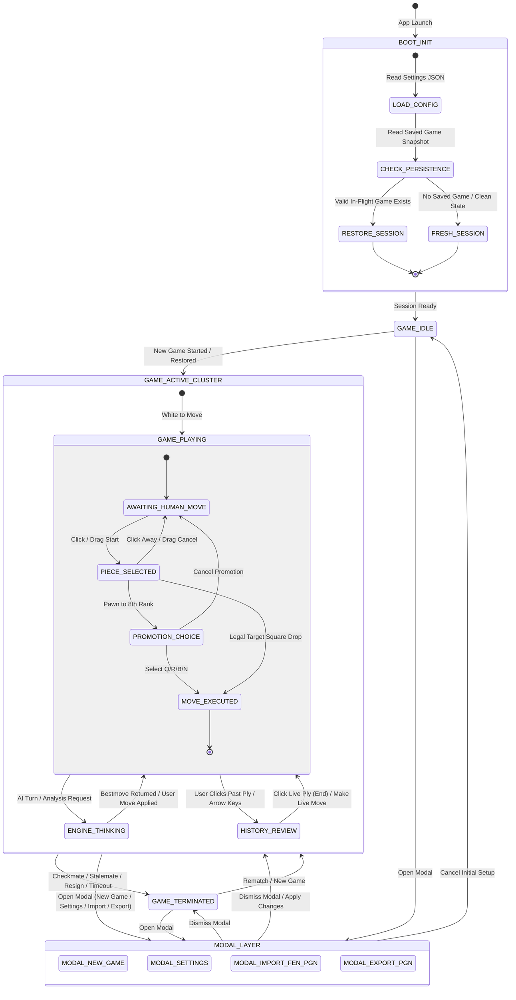
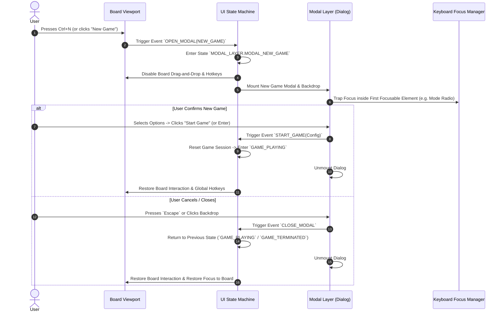
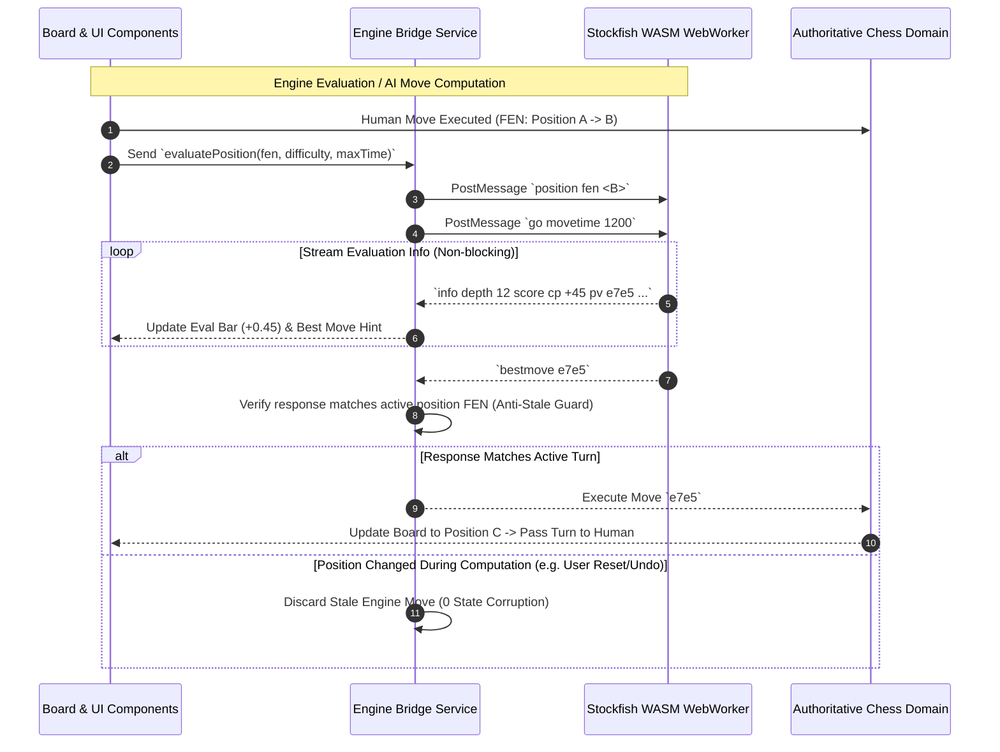
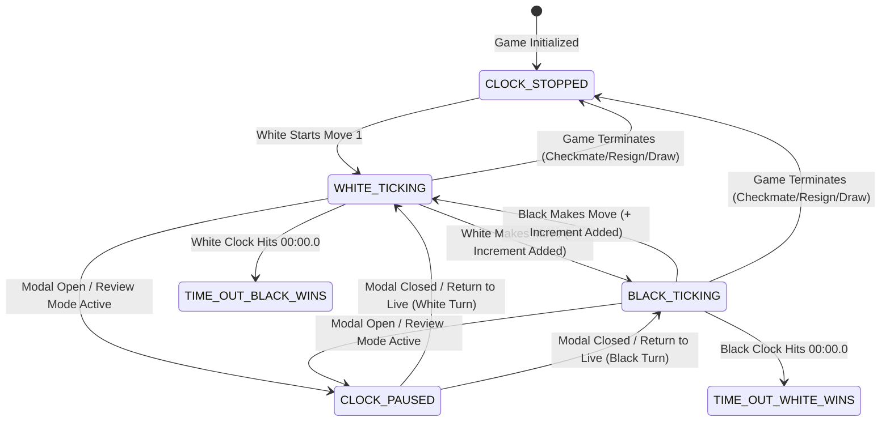

# ChessForge: UX State Machine & Navigation Map

**Sprint:** `Phase 01 · Sprint 02: UX Journeys and Information Architecture`  
**Author:** Dev Architect & Senior SDE  
**Status:** `Approved Specification Baseline`  
**Target Platform:** Windows 10/11 x64 Desktop (Tauri v2 + React UI)

---

## 1. High-Level Application State Machine

The ChessForge application UI behaves as a deterministic finite state machine (FSM). This guarantees zero orphan UI states, prevents race conditions during AI move calculation, and maintains complete separation between UI presentation and the authoritative chess domain.

---

## 2. Modal Overlay & Focus Transition Flow

Modals in ChessForge are rendered in a dedicated top-level portal layer above the game canvas with strict focus containment (focus trap) and backdrop blurring.

---

## 3. Engine Worker Interaction & Evaluation State Flow

The Stockfish WASM engine runs in a dedicated background `WebWorker`. The UI communicates strictly asynchronously via the UCI protocol without blocking React rendering.

---

## 4. Game Clock & Time Control State Machine

---

## 5. Complete UI State Transition Matrix

| Current State         | Event / Action               | Guard Condition                    | Target State                        | UI / System Effect                                                               |
| :-------------------- | :--------------------------- | :--------------------------------- | :---------------------------------- | :------------------------------------------------------------------------------- |
| `BOOT_INIT`           | `SNAPSHOT_LOADED`            | Saved game is valid                | `GAME_PLAYING`                      | Rehydrates game state, board positions, SAN table, and clocks.                   |
| `BOOT_INIT`           | `NO_SNAPSHOT`                | No saved session                   | `GAME_IDLE`                         | Sets standard starting position with default settings.                           |
| `AWAITING_HUMAN_MOVE` | `PIECE_CLICK / DRAG_START`   | Piece belongs to active player     | `PIECE_SELECTED`                    | Highlights source square and target legal destination squares.                   |
| `PIECE_SELECTED`      | `SQUARE_DROP / CLICK`        | Destination is legal non-promotion | `AWAITING_HUMAN_MOVE` (Turn switch) | Commits move, updates SAN, plays sound FX, triggers AI worker or opponent clock. |
| `PIECE_SELECTED`      | `SQUARE_DROP / CLICK`        | Destination is 8th rank pawn move  | `PROMOTION_CHOICE`                  | Displays Promotion Picker modal directly over target square.                     |
| `PROMOTION_CHOICE`    | `SELECT_PIECE(Q/R/B/N)`      | Valid piece choice                 | `AWAITING_HUMAN_MOVE` (Turn switch) | Promotes pawn to chosen piece, closes picker, passes turn.                       |
| `PROMOTION_CHOICE`    | `CANCEL / ESCAPE`            | None                               | `AWAITING_HUMAN_MOVE`               | Aborts move, restores pawn to source square, closes picker.                      |
| `GAME_PLAYING`        | `SELECT_HISTORY_PLY(N)`      | `0 <= N < totalPlies`              | `HISTORY_REVIEW`                    | Board renders historical position; clocks pause; live return banner shown.       |
| `HISTORY_REVIEW`      | `CLICK_LIVE_PLY / PRESS_END` | None                               | `GAME_PLAYING`                      | Board restores current live position; drag-and-drop enabled; clocks resume.      |
| `GAME_PLAYING`        | `MOVE_RESULTS_CHECKMATE`     | Legal move delivers mate           | `GAME_TERMINATED`                   | Stops clocks, locks board, displays Checkmate modal/banner.                      |
| `GAME_PLAYING`        | `MOVE_RESULTS_DRAW`          | Stalemate / 50-move / 3-fold       | `GAME_TERMINATED`                   | Stops clocks, locks board, displays Draw notification.                           |
| `GAME_PLAYING`        | `CLICK_RESIGN`               | User confirms in prompt            | `GAME_TERMINATED`                   | Concedes match, sets winner to opponent, logs result to history.                 |
| `ANY_STATE`           | `OPEN_MODAL(TYPE)`           | None                               | `MODAL_LAYER(TYPE)`                 | Dims background, freezes board interactions, traps keyboard focus.               |
| `MODAL_LAYER`         | `CLOSE_MODAL / ESCAPE`       | None                               | `PREVIOUS_STATE`                    | Unmounts modal, returns focus to previous active UI component.                   |
| `GAME_TERMINATED`     | `CLICK_REMATCH`              | Same players/settings              | `GAME_PLAYING`                      | Inverts player colors (if chosen), resets board and clocks to new game.          |
